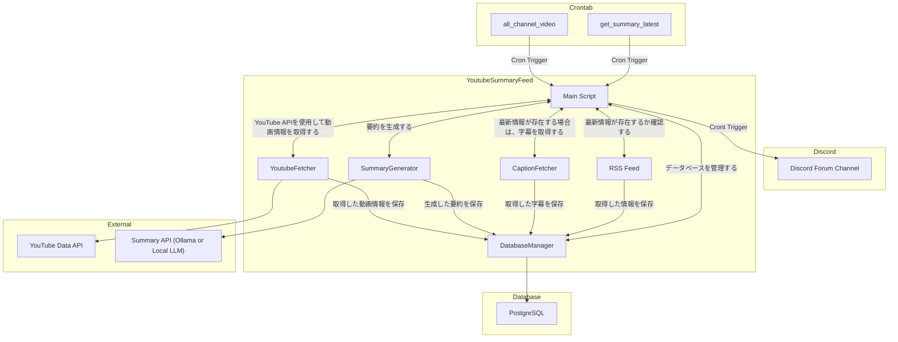

```mermaid
graph TD
    subgraph Crontab
        LatestVideo[get_summary_latest]
        AllChannelVideo[all_channel_video]
    end

    subgraph Discord
        DChannel[Discord Forum Channel]
    end

    subgraph YoutubeSummaryFeed
        MainScript[Main Script]
        RSSFeed[RSS Feed]
        YoutubeFetcher[YoutubeFetcher]
        CaptionFetcher[CaptionFetcher]
        SummaryGenerator[SummaryGenerator]
        DatabaseManager[DatabaseManager]
    end

    subgraph External
        YTAPI["YouTube Data API"]
        Ollama["Summary API (Ollama or Local LLM)"]
    end

    subgraph Database
        Postgres["PostgreSQL"]
    end

    %% Crontab flow
    LatestVideo -->|Cron Trigger| MainScript
    AllChannelVideo -->|Cron Trigger| MainScript


    %% MainScript internal flow
    MainScript <--> |最新情報が存在するか確認する|RSSFeed
    MainScript <--> |最新情報が存在する場合は、字幕を取得する|CaptionFetcher
    MainScript <--> |要約を生成する|SummaryGenerator
    MainScript <--> |データベースを管理する|DatabaseManager
    MainScript <--> |YouTube APIを使用して動画情報を取得する|YoutubeFetcher

    RSSFeed -->|取得した情報を保存| DatabaseManager 
    CaptionFetcher -->|取得した字幕を保存| DatabaseManager
    SummaryGenerator -->|生成した要約を保存| DatabaseManager
    YoutubeFetcher -->|取得した動画情報を保存| DatabaseManager

    %% External API calls
    YoutubeFetcher --> YTAPI
    SummaryGenerator --> Ollama

    %% Database interactions
    DatabaseManager --> Postgres

    %% MainScript outputs
    MainScript -->|Cront Trigger| DChannel


```
