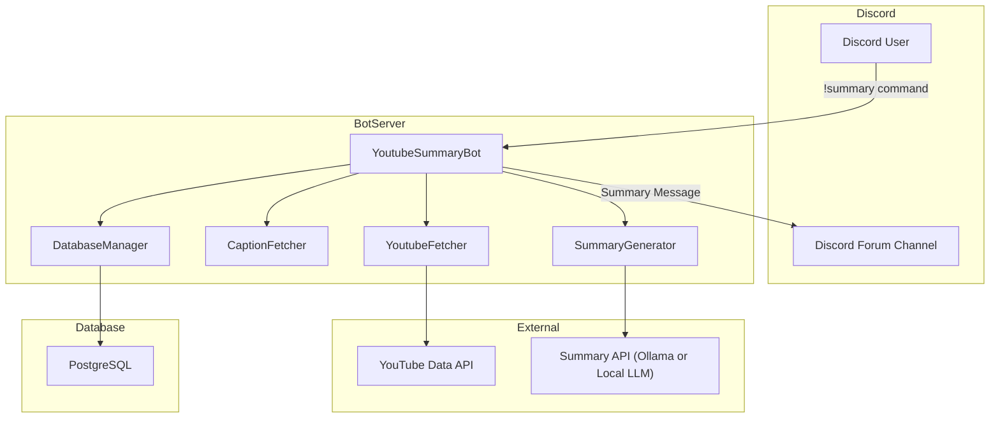

```mermaid
graph TD
    subgraph Discord
        DUser[Discord User]
        DChannel[Discord Forum Channel]
    end

    subgraph BotServer
        Bot[YoutubeSummaryBot]
        YoutubeFetcher[YoutubeFetcher]
        CaptionFetcher[CaptionFetcher]
        SummaryGenerator[SummaryGenerator]
        DatabaseManager[DatabaseManager]
    end

    subgraph External
        YTAPI["YouTube Data API"]
        Ollama["Summary API (Ollama or Local LLM)"]
    end

    subgraph Database
        Postgres["PostgreSQL"]
    end

    %% User interaction
    DUser -->|!summary command| Bot

    %% Bot internal flow
    Bot --> YoutubeFetcher
    Bot --> CaptionFetcher
    Bot --> SummaryGenerator
    Bot --> DatabaseManager

    %% External API calls
    YoutubeFetcher --> YTAPI
    SummaryGenerator --> Ollama

    %% Database interactions
    DatabaseManager --> Postgres

    %% Bot outputs
    Bot -->|Summary Message| DChannel


```
