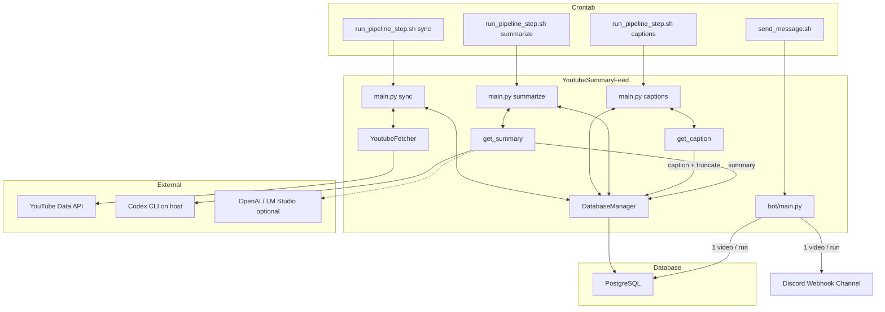

```mermaid
graph TD
    subgraph Crontab
        SyncJob[run_pipeline_step.sh sync]
        CaptionsJob[run_pipeline_step.sh captions]
        SummarizeJob[run_pipeline_step.sh summarize]
        SendMessage[send_message.sh]
    end

    subgraph YoutubeSummaryFeed
        MainSync[main.py sync]
        MainCaptions[main.py captions]
        MainSummarize[main.py summarize]
        BotMain[bot/main.py]
        YoutubeFetcher[YoutubeFetcher]
        CaptionFetcher[get_caption]
        SummaryGenerator[get_summary]
        DatabaseManager[DatabaseManager]
    end

    subgraph External
        YTAPI[YouTube Data API]
        CodexCLI[Codex CLI on host]
        OpenAIorLM[OpenAI / LM Studio optional]
    end

    subgraph Database
        Postgres[PostgreSQL]
    end

    SyncJob --> MainSync
    CaptionsJob --> MainCaptions
    SummarizeJob --> MainSummarize
    SendMessage --> BotMain

    MainSync <--> YoutubeFetcher
    MainSync <--> DatabaseManager
    MainCaptions <--> CaptionFetcher
    MainCaptions <--> DatabaseManager
    MainSummarize <--> SummaryGenerator
    MainSummarize <--> DatabaseManager

    YoutubeFetcher --> YTAPI
    CaptionFetcher -->|caption + truncate| DatabaseManager
    SummaryGenerator -->|summary| DatabaseManager
    SummaryGenerator --> CodexCLI
    SummaryGenerator -.-> OpenAIorLM
    DatabaseManager --> Postgres
    BotMain -->|1 video / run| Postgres
    BotMain -->|1 video / run| DChannel[Discord Webhook Channel]
```
