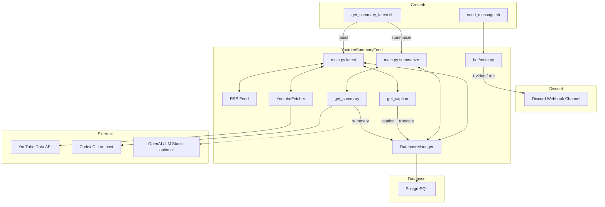

```mermaid
graph TD
    subgraph Crontab
        LatestVideo[get_summary_latest.sh]
        SendMessage[send_message.sh]
    end

    subgraph Discord
        DChannel[Discord Webhook Channel]
    end

    subgraph YoutubeSummaryFeed
        MainLatest[main.py latest]
        MainSummarize[main.py summarize]
        BotMain[bot/main.py]
        RSSFeed[RSS Feed]
        YoutubeFetcher[YoutubeFetcher]
        CaptionFetcher[get_caption]
        SummaryGenerator[get_summary]
        DatabaseManager[DatabaseManager]
    end

    subgraph External
        YTAPI[YouTube Data API]
        CodexCLI[Codex CLI on host]
        OpenAIorLM[OpenAI / LM Studio optional]
    end

    subgraph Database
        Postgres[PostgreSQL]
    end

    LatestVideo -->|latest| MainLatest
    LatestVideo -->|summarize| MainSummarize
    SendMessage --> BotMain

    MainLatest <--> RSSFeed
    MainLatest <--> CaptionFetcher
    MainLatest <--> DatabaseManager
    MainLatest <--> YoutubeFetcher

    MainSummarize <--> SummaryGenerator
    MainSummarize <--> DatabaseManager

    CaptionFetcher -->|caption + truncate| DatabaseManager
    SummaryGenerator -->|summary| DatabaseManager
    YoutubeFetcher --> YTAPI
    SummaryGenerator --> CodexCLI
    SummaryGenerator -.-> OpenAIorLM
    DatabaseManager --> Postgres
    BotMain -->|1 video / run| DChannel
```
