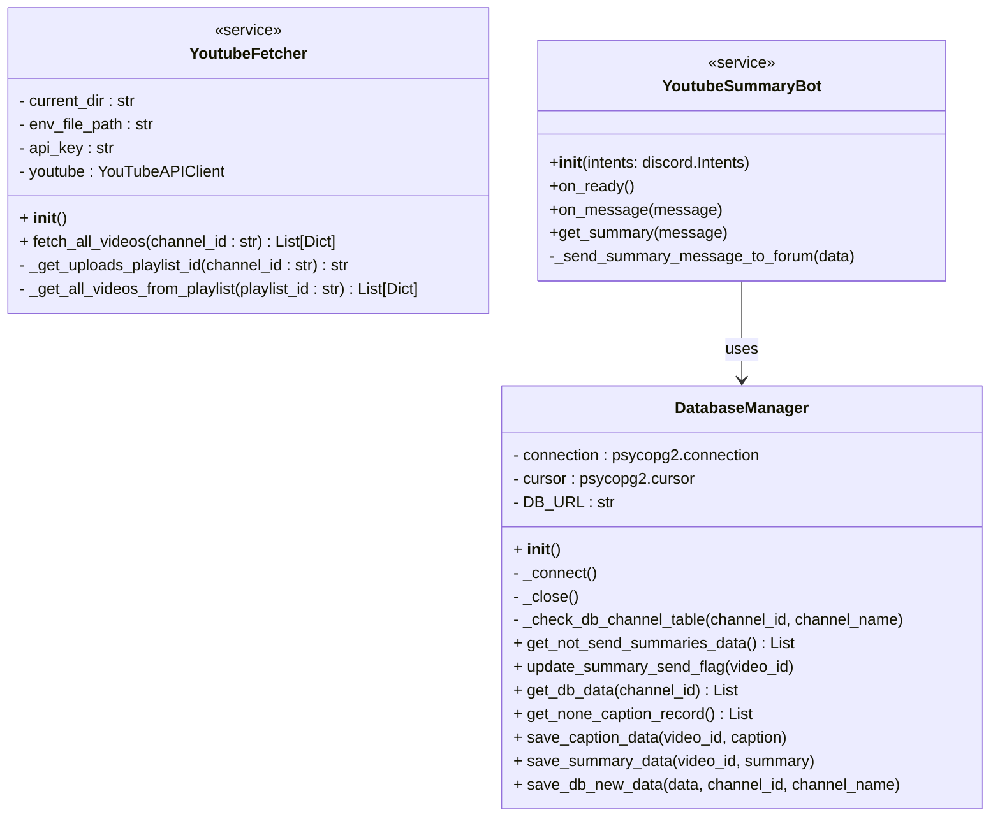

```mermaid
classDiagram
    class YoutubeFetcher {
        <<service>>
        - current_dir : str
        - env_file_path : str
        - api_key : str
        - youtube : YouTubeAPIClient

        + __init__()
        + fetch_all_videos(channel_id : str) List[Dict]
        - _get_uploads_playlist_id(channel_id : str) str
        - _get_all_videos_from_playlist(playlist_id : str) List[Dict]
    }

    class YoutubeSummaryBot {
        <<service>>
        +__init__(intents: discord.Intents)
        +on_ready()
        +on_message(message)
        +get_summary(message)
        -_send_summary_message_to_forum(data)
    }


    class DatabaseManager {
        - connection : psycopg2.connection
        - cursor : psycopg2.cursor
        - DB_URL : str

        + __init__()
        - _connect()
        - _close()
        - _check_db_channel_table(channel_id, channel_name)
        
        + get_not_send_summaries_data() List
        + update_summary_send_flag(video_id)
        + get_db_data(channel_id) List
        + get_none_caption_record() List
        + save_caption_data(video_id, caption)
        + save_summary_data(video_id, summary)
        + save_db_new_data(data, channel_id, channel_name)
    }


    YoutubeSummaryBot --> DatabaseManager : uses
```
