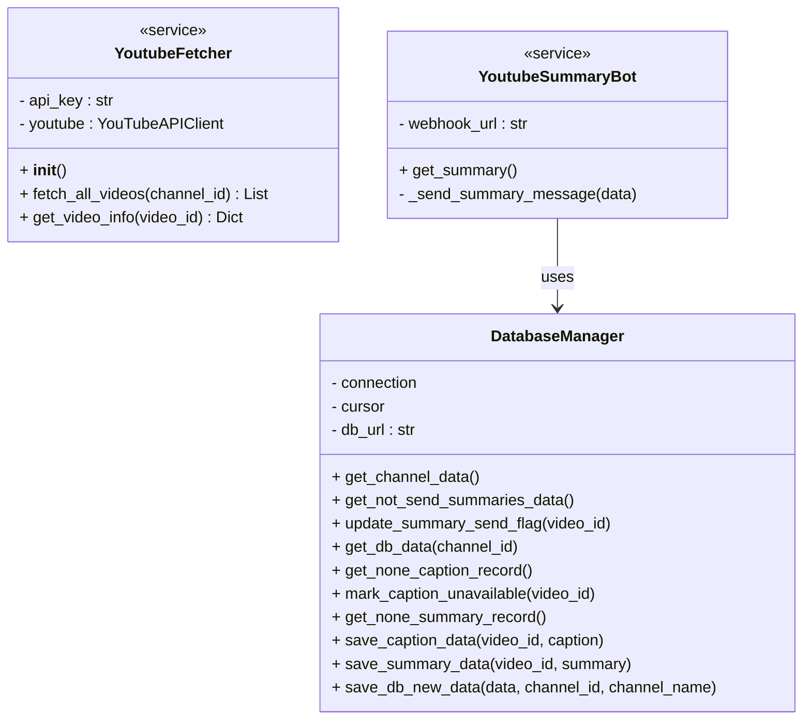

```mermaid
classDiagram
    class YoutubeFetcher {
        <<service>>
        - api_key : str
        - youtube : YouTubeAPIClient
        + __init__()
        + fetch_all_videos(channel_id) List
        + get_video_info(video_id) Dict
    }

    class YoutubeSummaryBot {
        <<service>>
        - webhook_url : str
        + get_summary()
        - _send_summary_message(data)
    }

    class DatabaseManager {
        - connection
        - cursor
        - db_url : str
        + get_channel_data()
        + get_not_send_summaries_data()
        + update_summary_send_flag(video_id)
        + get_db_data(channel_id)
        + get_none_caption_record()
        + mark_caption_unavailable(video_id)
        + get_none_summary_record()
        + save_caption_data(video_id, caption)
        + save_summary_data(video_id, summary)
        + save_db_new_data(data, channel_id, channel_name)
    }

    YoutubeSummaryBot --> DatabaseManager : uses
```
