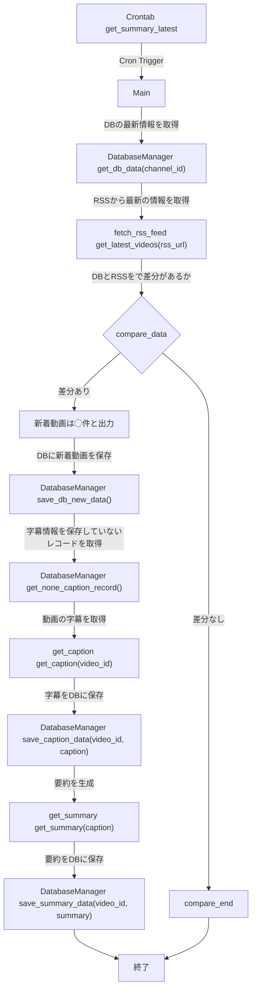
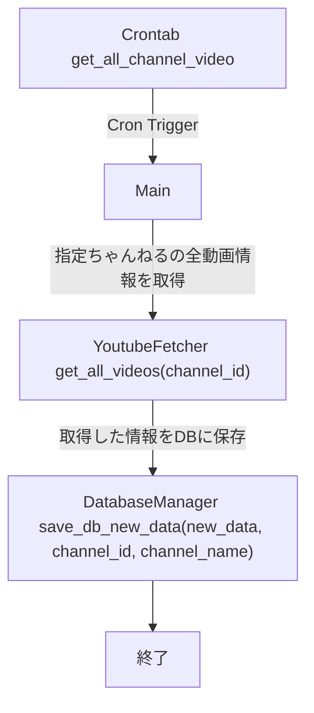
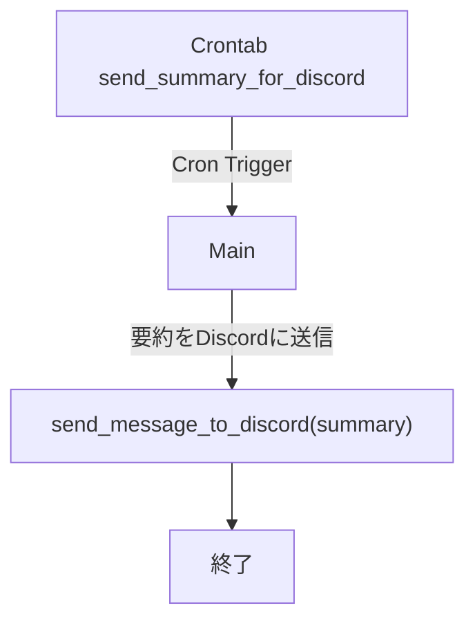

# 動画要約のフロー図
## 最新の動画を取得して要約を生成するフロー

```mermaid
graph TD

Cron["Crontab get_summary_latest"] -->|Cron Trigger| YoutubeSummaryFeed["Main"]
YoutubeSummaryFeed --> |DBの最新情報を取得| DB["DatabaseManager get_db_data(channel_id)"]
DB --> |RSSから最新の情報を取得| RSS["fetch_rss_feed get_latest_videos(rss_url)"]
RSS --> |DBとRSSをで差分があるか|compare{"compare_data"}

compare -->|差分あり| NewDataFound["新着動画は◯件と出力"]
NewDataFound --> |DBに新着動画を保存| DBUpdateNewData["DatabaseManager save_db_new_data()"]
DBUpdateNewData --> |字幕情報を保存していないレコードを取得| GetNoCaptionRecord["DatabaseManager get_none_caption_record()"]
GetNoCaptionRecord --> |動画の字幕を取得| CaptionFetcher["get_caption get_caption(video_id)"]
CaptionFetcher --> |字幕をDBに保存| DBUpdateCaption["DatabaseManager save_caption_data(video_id, caption)"]
DBUpdateCaption --> |要約を生成| SummaryGenerator["get_summary get_summary(caption)"]
SummaryGenerator --> |要約をDBに保存| DBUpdateSummary["DatabaseManager save_summary_data(video_id, summary)"]
DBUpdateSummary --> End["終了"]


compare --> |差分なし| compare_end --> End 
```

## チャンネルの全動画を取得する

```mermaid
graph TD

Cron["Crontab get_all_channel_video"] -->|Cron Trigger| YoutubeSummaryFeed["Main"]
YoutubeSummaryFeed --> |指定ちゃんねるの全動画情報を取得| YoutubeFetcher["YoutubeFetcher get_all_videos(channel_id)"]
YoutubeFetcher --> |取得した情報をDBに保存| SaveDB["DatabaseManager save_db_new_data(new_data, channel_id, channel_name)"]
SaveDB --> End["終了"]
```

## 要約をDiscordに投稿するフロー

```mermaid
graph TD
Cron["Crontab send_summary_for_discord"] -->|Cron Trigger| DiscordSend["Main"]
DiscordSend --> |要約をDiscordに送信| SendMessage["send_message_to_discord(summary)"]
SendMessage --> End["終了"]


```