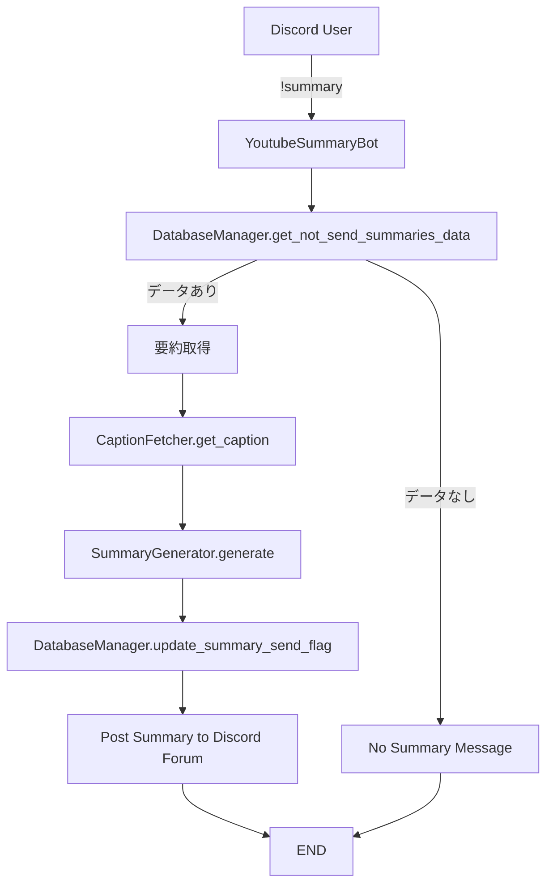
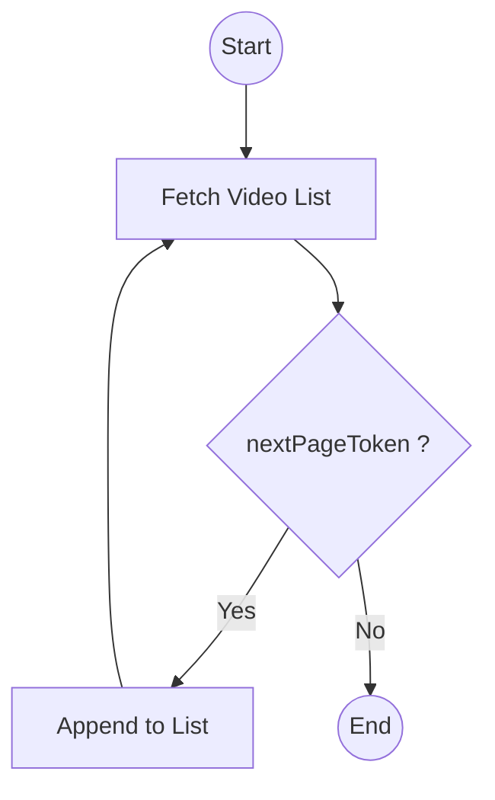

```mermaid
graph TD

User["Discord User"] -->|!summary| Bot["YoutubeSummaryBot"]

Bot --> DB["DatabaseManager.get_not_send_summaries_data"]
DB -->|データあり| SummaryFound["要約取得"]
DB -->|データなし| NoSummary["No Summary Message"]

SummaryFound --> CaptionFetcher["CaptionFetcher.get_caption"]
CaptionFetcher --> SummaryGenerator["SummaryGenerator.generate"]

SummaryGenerator --> DBUpdate["DatabaseManager.update_summary_send_flag"]
DBUpdate --> PostSummary["Post Summary to Discord Forum"]
PostSummary --> End["END"]

NoSummary --> End

```

```mermaid
graph TD

A((Start))
B[Fetch Video List]
C{nextPageToken ?}
D[Append to List]
E((End))

A --> B --> C
C -- Yes --> D --> B
C -- No --> E
```
