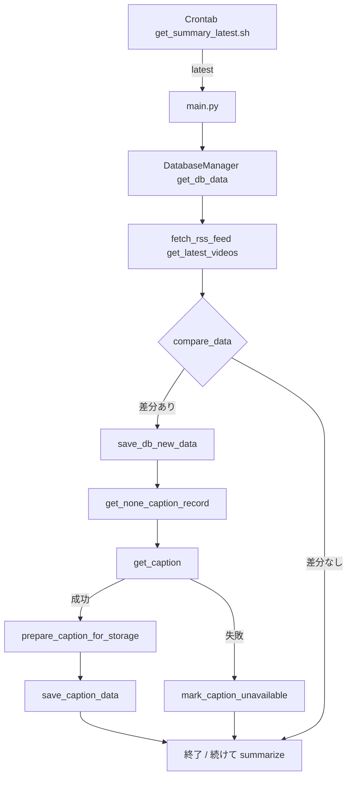
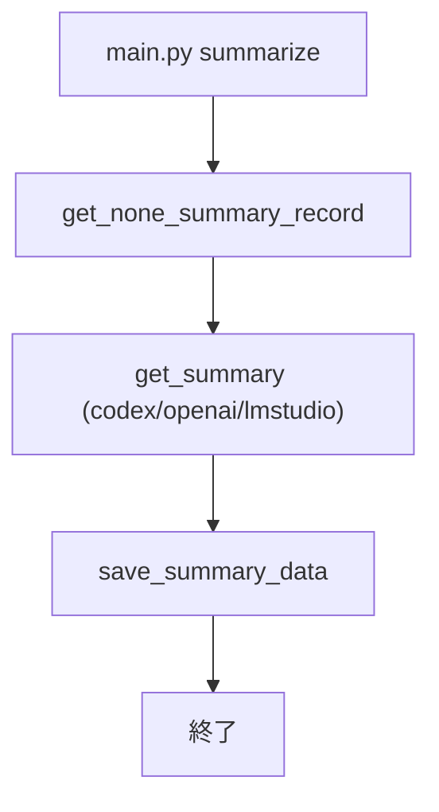
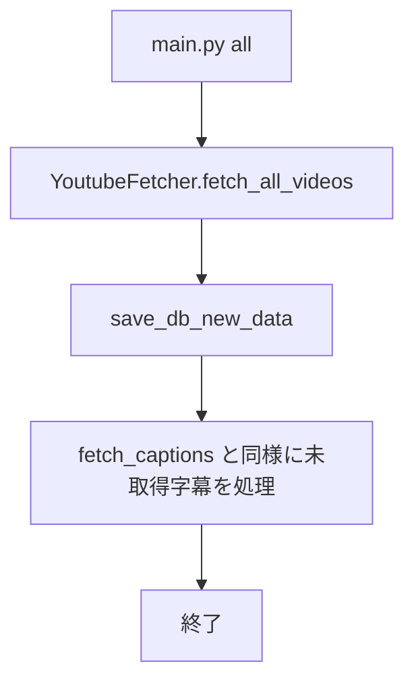
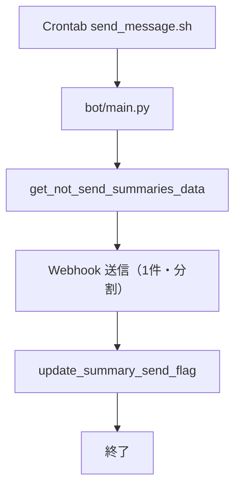

# 動画要約のフロー図

## 最新動画: 字幕取得（latest）

```mermaid
graph TD
Cron["Crontab get_summary_latest.sh"] -->|latest| Main["main.py"]
Main --> DB["DatabaseManager get_db_data"]
DB --> RSS["fetch_rss_feed get_latest_videos"]
RSS --> compare{"compare_data"}

compare -->|差分あり| SaveNew["save_db_new_data"]
SaveNew --> NoCap["get_none_caption_record"]
NoCap --> Cap["get_caption"]
Cap -->|成功| Prep["prepare_caption_for_storage"]
Prep --> SaveCap["save_caption_data"]
Cap -->|失敗| Mark["mark_caption_unavailable"]
SaveCap --> End["終了 / 続けて summarize"]
Mark --> End
compare -->|差分なし| End
```

## 要約生成（summarize）

```mermaid
graph TD
Main["main.py summarize"] --> Rows["get_none_summary_record"]
Rows --> Sum["get_summary (codex/openai/lmstudio)"]
Sum --> Save["save_summary_data"]
Save --> End["終了"]
```

## チャンネル全動画（all）

```mermaid
graph TD
Main["main.py all"] --> YF["YoutubeFetcher.fetch_all_videos"]
YF --> Save["save_db_new_data"]
Save --> CapLoop["fetch_captions と同様に未取得字幕を処理"]
CapLoop --> End["終了"]
```

## Discord 投稿

```mermaid
graph TD
Cron["Crontab send_message.sh"] --> Bot["bot/main.py"]
Bot --> Get["get_not_send_summaries_data"]
Get --> Send["Webhook 送信（1件・分割）"]
Send --> Flag["update_summary_send_flag"]
Flag --> End["終了"]
```
